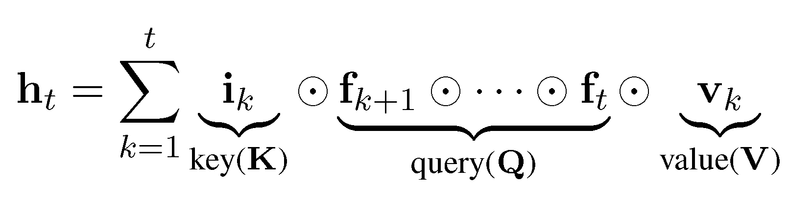
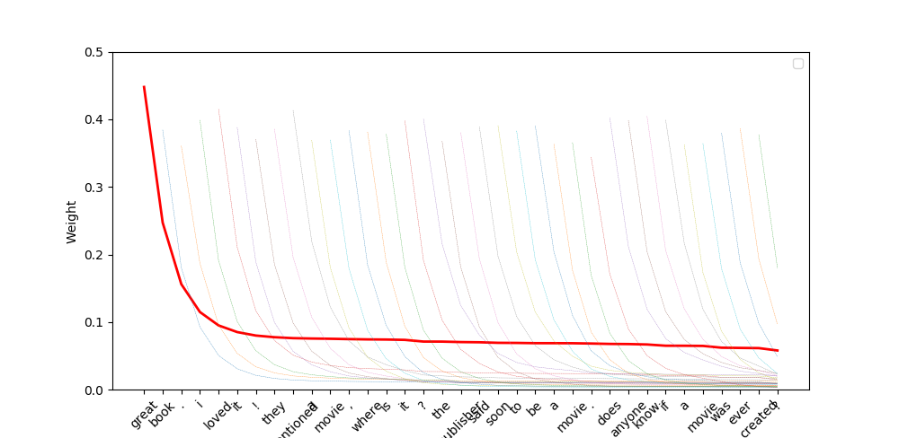
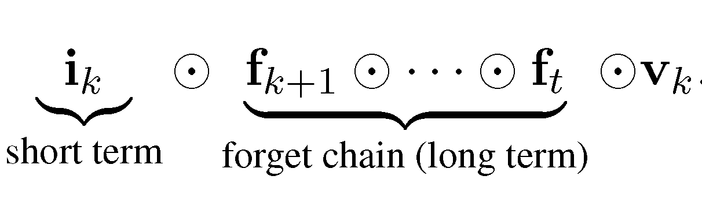

# lrn
Source code for "A Lightweight Recurrent Network for Sequence Modeling"


## Model Architecture
In our new paper, we propose lightweight recurrent network, which combines the strengths of 
[ATR](https://arxiv.org/abs/1810.12546) and [SRU](https://arxiv.org/abs/1709.02755). 

* ATR helps reduces model parameters and avoids additional free parameters for gate calculation, through the twin-gate
mechanism
* SRU follows the [QRNN](https://arxiv.org/abs/1611.01576) and moves all recurrent computations outside the recurrence.

Based on the above units, we propose [LRN](xxx):


where g(&middot;) is an activation function, *tanh* or *identity*. W<sub>q</sub>, W<sub>k</sub> and W<sub>v</sub> 
are model parameters. The matrix computation (as well as potential layer noramlization) can be shfited outside the 
recurrence. Therefore, the whole model is fast in running.

When applying twin-gate mechanism, the output value in **h**<sub>t</sub> might suffer explosion issue, 
which could grow into infinity. This is the reason we added the activation function. Another alternative solution
would be using layer normalization, which forces activation values to be stable.

## Structure Analysis
One way to understand the model is to unfold the LRN structure along input tokens:


The above structure which is also observed by [Zhang et al.](https://arxiv.org/abs/1810.12546), [Lee et al.](https://arxiv.org/abs/1705.07393), 
and etc, endows the RNN model with multiple interpretations. We provide two as follows:

* *Relation with Self Attention Networks*


Informally, LRN assembles forget gates from step *t* to step *k+1* in order to query the key (input gate). The result 
weight is assigned to the corresponding value representation and contributes to the final hidden representation.

Does the learned weights make sense? We do a classification tasks on AmaPolar task with a unidirectional linear-LRN.
The final hidden state is feed into the classifier. One example below shows the learned weights. The term *great* gains
a large weight, which decays slowly and contributes the final *positive* decision.


* *Long-term and Short-term Memory*


Another view of the unfolded structure is that different gates form different memory mechanism. The input gate acts as
a short-term memory and indicates how many information can be activated in this token. The forget gates form a forget
chain that controls how to erase meaningless past information.

## Experiments 

We did experiment on six different tasks:
* [Natural Language Inference](nli)
* [Document Classification](doc)
* [Machine Translation](mt)
* [Reading Comprehension](rc)
* [Named Entity Recognition](ner)
* [Language Modeling](lm)


## Citation

Please cite the following paper:
> Biao Zhang; Rico Sennrich (2019). *A Lightweight Recurrent Network for Sequence Modeling*. 
In Proceedings of the 57th Annual Meeting of the Association for Computational Linguistics. Florence, Italy.

```
@inproceedings{zhang-sennrich:2019:ACL,
  address = "Florence, Italy",
  author = "Zhang, Biao and Sennrich, Rico",
  booktitle = "{Proceedings of the 57th Annual Meeting of the Association for Computational Linguistics}",
  publisher = "Association for Computational Linguistics",
  title = "{A Lightweight Recurrent Network for Sequence Modeling}",
  year = "2019"
}
```

## Contact

For any further comments or questions about LRN, please email <a href="mailto:b.zhang@ed.ac.uk">Biao Zhang</a>.